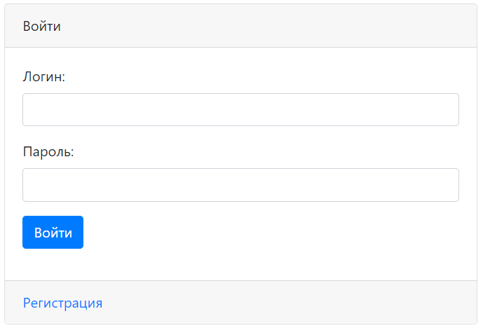
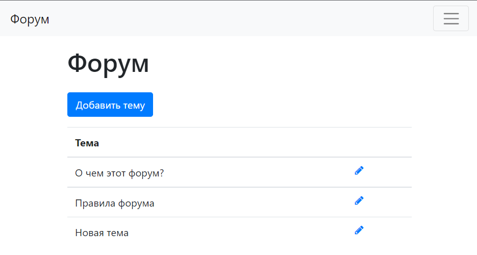

# job4j_forum

Учебный мини-проект в рамках курса [job4j](https://job4j.ru/)  
Технологии: Java 17, Spring Boot, Hibernate, Spring Data, Spring Security, JSP, JSTL, Postgres, Liquibase, Bootstrap 4   
Реализованные возможности:
- Регистрация пользователя
- Создание/редактирование поста

